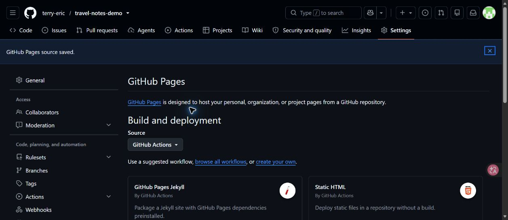
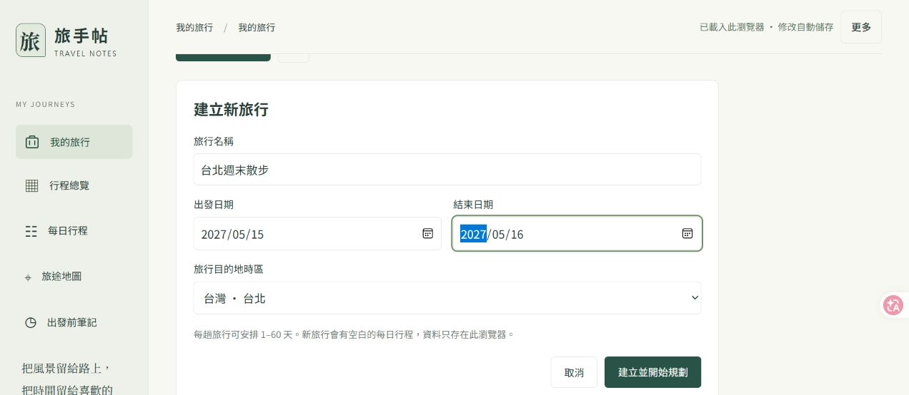
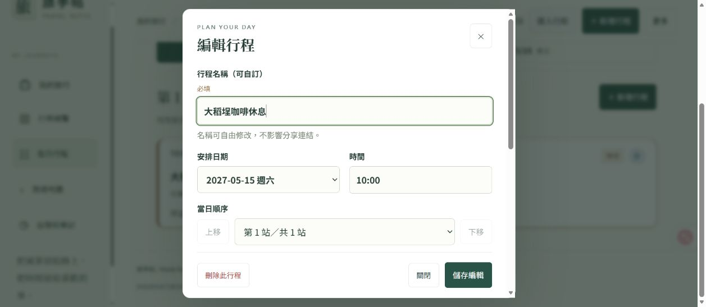
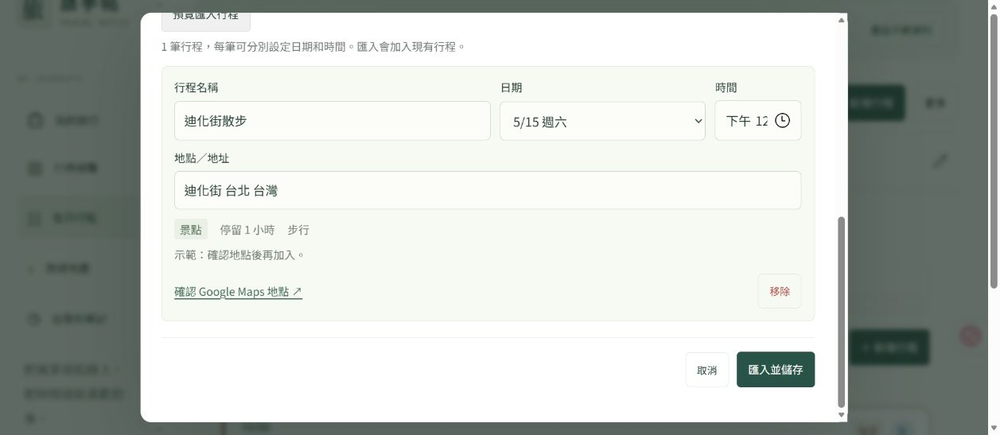

# 旅手帖 Travel Notes

以每日行程為中心的繁體中文旅行規劃工具：建立多個行程、安排景點與停留時間、調整順序、整理出發前筆記，並透過 Google Maps 查看地點與路線。雲端版支援 email 登入，以及每個行程各自的檢視者與編輯者權限。

[開啟公開示範](https://terry-eric.github.io/travel-notes-demo/) · [GitHub 原始碼](https://github.com/terry-eric/travel-notes-demo)

公開示範採用示範資料，修改保存在目前瀏覽器。要跨裝置同步、登入或與朋友共同編輯，請依下方步驟部署 Cloudflare Workers、D1 和 Access。這個儲存庫提供部署範本；GitHub Pages 不會建立雲端資料庫。

## 三種執行方式

| 方式 | 資料儲存 | 身分與分享 | 適合用途 |
| --- | --- | --- | --- |
| GitHub Pages／`dev:demo` | 目前瀏覽器的 localStorage | 示範帳號與權限；沒有真正的登入、邀請信或多人同步 | 試用介面、公開展示 |
| `npm run dev` | 本機 `.local/preview.sqlite` | 預覽程式代入測試 email，沒有 Access 登入 | 開發 API 與資料操作 |
| Cloudflare Workers | Cloudflare D1 | Access email OTP 登入；伺服器檢查每個行程的權限 | 私人使用、跨裝置、多人協作 |

GitHub Pages 示範與雲端版資料彼此獨立。請勿把真實行程、私人 email 名單、D1 匯出、登入憑證或 API key 加入公開示範。示範中的更改只在同一個瀏覽器與網站來源保留；清除網站資料、使用無痕模式或按下示範重設後，資料可能消失。

## 本機快速開始

需要 Git 與 **Node.js 24 LTS**。本機資料庫使用 Node 內建的 `node:sqlite`，不需另外安裝 SQLite。npm lockfile 固定相依套件，包含 Wrangler **4.145.0**。

```powershell
git clone https://github.com/terry-eric/travel-notes-demo.git
cd travel-notes-demo
npm ci
npm run build
npm test
npm run dev:demo
```

開啟終端機印出的網址（示範伺服器標示為 `Demo:`）。`Ctrl+C` 停止伺服器。可指定示範網站的連接埠與子路徑：

```powershell
npm run dev:demo -- --port=4173 --base=/travel-notes-demo
```

| 指令 | 用途／輸出 |
| --- | --- |
| `npm run build` | 產生雲端 Worker 使用的 `dist/server/index.js`，不需 `.openai` 設定 |
| `npm run build:demo` | 產生 GitHub Pages 的靜態 `_site/` |
| `npm run dev:demo` | 建置並預覽瀏覽器本機示範 |
| `npm run dev` | 在 loopback 啟動 Node／SQLite 開發預覽；開啟印出的 `/trips` 網址 |
| `npm run dev:trip` | 同一個開發預覽，測試 `/trip` 子路徑 |
| `npm test` | 執行 Node 測試；初次測試前先執行 `npm run build` |
| `npm run deploy` | 建置並將雲端版部署至自己設定的 Cloudflare 帳號 |

開發預覽預設身分為 `owner@example.com`，只綁定 `127.0.0.1`。若要檢查另一個使用者建立自己的行程，可在 PowerShell 設定：

```powershell
$env:TRIP_PREVIEW_EMAIL = 'friend@example.com'
npm run dev
```

`TRIP_PREVIEW_DB` 可指定另一個本機 SQLite 檔案；預設為 `.local/preview.sqlite`。這些開發身分不代表已驗證的雲端登入。請使用雲端版測試真正的 Access 登入流程。

### 完整本機版：Node + SQLite

不需要 Cloudflare 帳號或網域，就能在自己的電腦開啟完整的行程 API 與 SQLite 資料庫：

```powershell
npm ci
npm run build
npm test
npm run dev
```

伺服器會選擇可用連接埠（port `0` 表示由系統分配），印出例如 `Local: http://127.0.0.1:12345/trips` 的網址；請複製實際輸出，不要把範例連接埠當成固定值。資料第一次使用時會建立 `.local/preview.sqlite`，依序套用本機遷移並初始化虛構台灣範例。停止伺服器後資料仍在，重新執行即可繼續。

想測試雲端預設的 `/trip` 子路徑時，停止原本預覽再執行：

```powershell
npm run dev:trip
```

macOS／Linux 也使用同一組 npm 指令。模擬其他帳號的寫法為：

```sh
TRIP_PREVIEW_EMAIL=friend@example.com npm run dev
```

本機版是單機開發預覽，以指定 email 測試資料權限；它沒有真正的登入，也沒有外部分享網址。共同編輯或跨裝置使用請採用下方的 Cloudflare 部署。

本機 `npm run dev`／`dev:trip` 只讀取程序環境變數，**不會自動載入 `.env` 或 `.dev.vars`**。若需選配的 Maps key，在執行 npm 前設定 `GOOGLE_MAPS_EMBED_KEY`，或將 `.env.example` 複製為 `.env`、填入 key，再使用 Node 的明確載入方式：

```powershell
node --env-file=.env scripts/dev.mjs
```

macOS／Linux 同樣可執行這條 Node 指令。`.dev.vars` 是 Wrangler 本機開發用的設定，不能取代此處 Node 程式的環境變數。公開靜態示範不會讀取以上任何 key。

## GitHub Pages 公開示範

儲存庫的 Pages workflow 只上傳 `npm run build:demo` 產生的 `_site/`，不會部署 Worker、D1、Access 設定或本機資料庫。

1. Fork 或建立自己的公開儲存庫，保留 `.github/workflows/pages.yml`。
2. 在 **Settings → Pages → Build and deployment → Source** 選擇 **GitHub Actions**。
3. 推送至預設的 `main` 分支，或從 Actions 頁面手動執行 Pages workflow。
4. 等待建置與部署成功，開啟 workflow 的 `github-pages` 環境網址。



上圖為此儲存庫的 Pages 設定頁。Fork 後請在自己的儲存庫完成相同設定。

專案型 Pages 網址通常為 `https://<帳號>.github.io/<儲存庫>/`。示範的頁面切換使用 `index.html?page=…`，可在儲存庫子路徑重新整理或分享連結。雲端版仍使用 `/trip/trips`、`/trip/daily` 等路徑。

workflow 使用 `actions/configure-pages@v5`、`actions/upload-pages-artifact@v4` 與 `actions/deploy-pages@v4`，部署工作需要 `pages: write`、`id-token: write` 和 `github-pages` 環境。設定方式見 [GitHub Pages 自訂 workflow 官方文件](https://docs.github.com/en/pages/getting-started-with-github-pages/using-custom-workflows-with-github-pages)。

## Cloudflare 私人多人版

以下以 **`https://trip.example.com/trip`** 為範例。請全部換成自己的主機、網域、帳號與 email；`example.com` 和範本識別碼無法直接部署成可用服務。

### 1. 準備帳號、網域與設定檔

需要 Cloudflare 帳號、已加入 Cloudflare 的網域，以及該主機的 **Proxied（橘雲）DNS** 記錄。Worker 採用 Route 掛在既有主機的子路徑；此範本不使用完整主機的 Custom Domain 路由。

```powershell
npm ci
Copy-Item wrangler.example.jsonc wrangler.jsonc
npx wrangler login
```

macOS／Linux 將複製設定檔那一行改為 `cp wrangler.example.jsonc wrangler.jsonc`，其餘 npm／Wrangler 指令相同。

編輯本機 `wrangler.jsonc`：

| 欄位 | 範例 | 說明 |
| --- | --- | --- |
| `name` | `travel-notes` | 自己的 Worker 名稱 |
| `routes[0].pattern` | `trip.example.com/trip*` | 主機與子路徑的 Worker Route |
| `routes[0].zone_name` | `example.com` | 這個主機所在的 Cloudflare Zone |
| `vars.APP_HOST` | `trip.example.com` | 小寫的完整 hostname；不含協定、連接埠或路徑 |
| `vars.APP_BASE` | `/trip` | 子路徑；不加結尾 `/`，根目錄使用空字串 `""` |
| `vars.ACCESS_ISSUER` | `https://your-team.cloudflareaccess.com` | Zero Trust team domain，含 `https://`，不加結尾 `/` |
| `vars.ACCESS_AUD` | Access application 的 AUD | 必須使用同一個 Access application 的 Application Audience |
| `vars.OWNER_EMAIL` | `owner@example.com` | 公開範例行程的初始擁有者；一般使用者仍可建立自己的行程 |
| `d1_databases[0].database_id` | 建立 D1 後取得的 UUID | 勿使用範本中的佔位文字 |

`APP_BASE` 可為 `/private/travel` 等由英數、底線、連字號組成的路徑。若改用根目錄，請同時改 Route 為 `trip.example.com/*`，並讓 Access 保護整個主機。若改用 `/travel`，Route、Access public hostname 的路徑及 `APP_BASE` 要一起修改。

範本的 `/trip*` 會包含 `/trip`、`/trip?trip=…` 及其下的資源。Cloudflare Route 比對包含查詢字串，所以只設定精確 `/trip` 與 `/trip/*` 會漏掉帶查詢字串的父路徑。Worker 再以 `APP_HOST` 和 `/trip` 的路徑邊界檢查請求，對 `/tripper` 或其他主機回傳 404；缺少或格式錯誤的主機／子路徑設定回傳 503。[Workers Route 比對規則](https://developers.cloudflare.com/workers/configuration/routing/routes/)

保持 `workers_dev: false` 與 `preview_urls: false`，避免新增未經同一套 Access 設定的公開入口。對應欄位見 [Wrangler 設定官方文件](https://developers.cloudflare.com/workers/wrangler/configuration/)。自己的 `wrangler.jsonc`、`.dev.vars`、`.env` 和本機資料庫不應提交到公開儲存庫。

### 2. 建立 D1 與套用完整資料表遷移

```powershell
npx wrangler d1 create travel-notes-db --config wrangler.jsonc
```

將輸出的 `database_id` 複製到 `wrangler.jsonc`，確認 `database_name` 是 `travel-notes-db`、binding 是 `DB`、`migrations_dir` 是 `drizzle`。接著查看並套用 **遠端** 遷移：

```powershell
npx wrangler d1 migrations list travel-notes-db --remote --config wrangler.jsonc
npx wrangler d1 migrations apply travel-notes-db --remote --config wrangler.jsonc
```

`--remote` 會操作雲端 D1；`--local` 操作 Wrangler 自己的本機資料庫，和 `npm run dev` 的 `.local/preview.sqlite` 不同。請確認名稱與 config 指向預期資料庫。[D1 Wrangler 指令](https://developers.cloudflare.com/d1/wrangler-commands/)

不要只建立最早的 `trips` 表。這個版本需要以下五個 SQL 檔案，Wrangler 會依序執行並記錄已套用的遷移：

| 檔案 | 用途 |
| --- | --- |
| `0000_tidy_sheva_callister.sql` | 舊版行程內容與 revision |
| `0001_flawless_texas_twister.sql` | 舊版邀請名單 |
| `0002_multi_trip.sql` | 多行程、每個行程的成員、遷移標記與舊表保護 |
| `0003_trip_archive.sql` | 刪除行程與恢復 |
| `0004_stop_creators.sql` | 景點建立者的歷史紀錄 |

SQL 本身不會帶入私人旅行資料。第一次通過驗證的 API 請求會把**虛構台灣範例**初始化給 `OWNER_EMAIL`；預設為 `owner@example.com`，Pages 的京都示範是另一組獨立資料。其他登入者的「我的旅行」可從空白開始。若要讓自己的帳號擁有範例，請在**第一次 API 使用之前**設定 `OWNER_EMAIL`。初始化後再改這個變數不會轉移既有行程的擁有者。

若從既有版本升級，先做下方的資料備份。`0002` 保留舊表作為恢復快照；首次 API 初始化後舊表被 trigger 鎖定。不要刪除遷移標記或解除保護來強迫重跑。[D1 migrations 官方說明](https://developers.cloudflare.com/d1/reference/migrations/)

### 3. 建立 Access email OTP 登入

先設定 Access 再發布 Worker，確保私人網址第一次開放時就需要登入。

1. 在 Cloudflare **Zero Trust → Integrations → Identity providers** 新增 **One-time PIN**。新的 Zero Trust 組織可能沒有自動啟用 OTP，需要手動新增。[One-time PIN 設定](https://developers.cloudflare.com/cloudflare-one/integrations/identity-providers/one-time-pin/)
2. 在 **Zero Trust → Access controls → Applications** 新增 **Self-hosted** application。
3. 在**同一個 application** 加入兩個 public hostname/path：`trip.example.com/trip` 和 `trip.example.com/trip/*`。父路徑與所有子路徑都必須受保護；`/trip/*` 單獨不涵蓋 `/trip`。[Access 路徑與 wildcard 規則](https://developers.cloudflare.com/cloudflare-one/access-controls/policies/app-paths/)
4. 登入方式選擇 **One-time PIN**，application **Session Duration 設為 24 hours**。Allow policy 用 **Emails** 明確列出自己的 email 及需要使用網站的朋友；policy session 若另行設定，也設為 24 hours。請避免 Bypass／Everyone，並檢查是否有重疊的 Access application 改變這些路徑的政策。[Self-hosted application](https://developers.cloudflare.com/cloudflare-one/access-controls/applications/http-apps/self-hosted-public-app/)、[Session management](https://developers.cloudflare.com/cloudflare-one/access-controls/access-settings/session-management/)
5. 從 application 的 **Additional settings** 複製 **Application Audience (AUD) Tag**，填入 `ACCESS_AUD`。將自己的 Zero Trust team domain 填入 `ACCESS_ISSUER`。

登入時輸入 email，收取一次性驗證碼並填回 Access 登入頁。24 小時是網站 session 的設定，OTP 驗證碼另有較短的有效期。退出／切換帳號會前往 `/cdn-cgi/access/logout`。

Worker 使用 `Cf-Access-Jwt-Assertion`，從固定 `ACCESS_ISSUER` 的 `/cdn-cgi/access/certs` 取得簽章公鑰，檢查 RS256、issuer、AUD、到期時間、not-before 與 email。單純自行傳入 email 或身分 header 不能取代這個驗證。沒有有效 JWT 的 API 回傳 401；Access 設定不完整時回傳 503。[Cloudflare 要求 Worker 驗證 Access JWT](https://developers.cloudflare.com/cloudflare-one/access-controls/applications/http-apps/authorization-cookie/validating-json/)

Access Allow policy 決定誰能登入整個網站；行程邀請決定登入後能讀寫哪些行程。兩者都需要設定。新增行程邀請不會寄出 email，也不會自動將對方加入 Cloudflare Access 的 Allow policy。

### 4. 建置、檢查與部署

確認 hostname、Route、D1 UUID、issuer、AUD 及 Access 政策都已完成後執行：

```powershell
npm run build
npm test
npx wrangler deploy --dry-run --config wrangler.jsonc
npm run deploy
```

`--dry-run` 僅檢查／打包，不會上傳 Worker；它不能驗證 DNS、Access dashboard 設定或遠端 D1 遷移是否正確。`npm run deploy` 會實際上傳至登入的帳號。[Workers deploy 指令](https://developers.cloudflare.com/workers/wrangler/commands/workers/)

部署後開啟 `https://trip.example.com/trip`，先完成 Access 登入，再檢查「我的旅行」。使用另一個允許登入的帳號檢查：可建立自己的行程，未受邀的行程無法取得內容，viewer 只能看，editor 可以儲存修改，只有 owner 可以管理邀請與刪除／恢復。透過邀請名單撤銷成員後，該成員不應再讀取該行程。

## 建立行程與共同編輯

每個登入帳號都能從「我的旅行」建立自己的行程，設定名稱、起訖日期與時區。進入行程後，可編輯每日景點、停留時間、交通方式、地圖連結與筆記；編輯者的景點建立者紀錄由伺服器保存。

### 圖解 1：從「我的旅行」開始



1. 開啟網站，選擇左側的 **我的旅行**。
2. 按 **＋ 建立新旅行**，填寫 **旅行名稱**、**出發日期**、**結束日期** 與 **旅行目的地時區**。
3. 按 **建立並開始規劃**。新旅行會按照選擇的日期建立空白每日行程。
4. 在清單點選旅行即可繼續編輯；可從 **已刪除** 區域恢復自己先前刪除的旅行。

本節畫面來自公開示範，示範帳號與示範行程可直接試用。相同的建立、編輯與匯入步驟適用於本機 SQLite 版和雲端版；真正的跨裝置資料與權限由自己部署的 Access／D1 版本提供。

### 圖解 2：新增／編輯每日行程



1. 進入一趟旅行，選擇 **每日行程** 與日期，按 **＋ 新增行程**。
2. 填寫名稱、時間、停留時間與行程標籤。**當日順序** 可選位置，或用 **上移／下移** 調整。
3. 展開 **地點與 Google Maps 分享連結**，填入具體店名／地址，或貼上 Google Maps 的分享連結。
4. 有已確認的航班、預約或演出，勾選 **固定時間（保留原定時間）**，再按 **儲存行程**。
5. 修改既有項目時先點開卡片，再按 **編輯行程**。交通欄位可開啟 Google Maps 路線，手動填分鐘數並按 **儲存並順延**。

### 圖解 3：匯入 GPT 規劃



1. 開啟旅行中的 **匯入行程**，切換到 **匯入 GPT 行程**。
2. 在提示詞中的 **我的需求** 填寫目的地、想去的地方與偏好，按 **複製提示詞**，貼到 ChatGPT 或其他 AI。
3. 取得指定格式的 JSON 後，貼回匯入對話框，按 **預覽匯入行程**。
4. 檢查日期、時間、地點、停留時間與固定預約；確認後按 **匯入並儲存**。

匯入會把項目加入現有行程，不會替換整趟旅行。一次支援 1–100 筆；AI 回覆的營業時間、地址與交通安排仍需自己查核。網站不會自動呼叫 OpenAI API，也不需要 OpenAI API key。

| 身分 | 查看行程 | 編輯內容 | 管理邀請 | 刪除／恢復行程 |
| --- | --- | --- | --- | --- |
| Owner（擁有者） | ✓ | ✓ | ✓ | ✓ |
| Editor（編輯者） | ✓ | ✓ | — | — |
| Viewer（檢視者） | ✓ | — | — | — |
| 其他已登入帳號 | 只能查看自己的或被邀請的行程 | 依該行程權限 | — | 只能管理自己的行程 |

擁有者在行程邀請介面填寫對方登入使用的 email，選擇 viewer 或 editor，將同一個行程連結交給對方。權限以行程為單位，不會因為加入某一個行程就看到其他人的行程。

雲端儲存使用 revision 檢查更新；多人修改時，前端嘗試合併，遇到衝突會讓使用者選擇。頁面會定期讀取新的版本，並保留尚未送出的本機草稿。這是輪詢與衝突合併，沒有聊天室、即時游標或完整的無限版本歷史。顯示連線／儲存錯誤時，先保留草稿並重新登入或重試。

## Google Maps（選配）

未設定 key 時仍可使用地點／Google Maps 連結。若需要 Maps Embed API 的路線 iframe，在 Google Cloud 建立自己的專案、依官方要求完成帳單設定並啟用 **Maps Embed API**，建立專用 API key。[Maps Embed API 入門](https://developers.google.com/maps/documentation/embed/get-api-key)

對這把 key 設定：

- **Application restrictions：Websites / HTTP referrers**，允許自己的 HTTPS origin，例如 `https://trip.example.com/*`，必要時加上 `https://trip.example.com`。請勿允許所有網站。
- **API restrictions：Restrict key → Maps Embed API**，不要讓同一把 key 同時授權不需要的 API。

瀏覽器傳給 Google 的 referrer 常只有 origin，請勿只限制 `/trip/*` 而漏掉 origin。若加上 `no-referrer`／`same-origin` 政策，地圖可能因為無法驗證 referrer 而拒絕顯示。[Google API key 安全建議](https://developers.google.com/maps/api-security-best-practices)、[Embed iframe 的 referrer 設定](https://developers.google.com/maps/documentation/embed/embedding-map)

完成第一次 Worker 部署後，在終端機互動輸入 key：

```powershell
npx wrangler secret put GOOGLE_MAPS_EMBED_KEY --config wrangler.jsonc
```

key 會出現在使用者瀏覽器的 iframe URL，因而可被看到；Cloudflare secret 僅避免把它直接放進儲存庫，網站與 API 限制仍需設定。公開 Pages 示範不需要這把 key，也不會從你的 Cloudflare 設定讀取它。

地圖 iframe 顯示的交通估計不會自動寫入行程時間表。本程式沒有付費 Routes／Directions API 的自動 ETA 計算；請自行確認交通時間並填寫。刪改前後景點或交通方式後，也應重新確認原本輸入的交通時間。

## 備份、升級與回退

更新前先匯出遠端 D1，備份檔含旅行內容與 email，請存放在公開儲存庫之外。下面路徑是 PowerShell 範例，可自行改成私人備份資料夾：

```powershell
$tripBackupDir = Join-Path $env:USERPROFILE 'PrivateTravelBackups'
New-Item -ItemType Directory -Force -Path $tripBackupDir
$tripBackupFile = Join-Path $tripBackupDir ('travel-notes-' + (Get-Date -Format 'yyyyMMdd-HHmmss') + '.sql')
npx wrangler d1 export travel-notes-db --remote --output $tripBackupFile --config wrangler.jsonc
npx wrangler d1 time-travel info travel-notes-db --config wrangler.jsonc
```

保存匯出檔、Time Travel bookmark 與更新前的 Worker version ID。備份檔不應放進 `_site/` 或 GitHub Pages artifact。[D1 匯入／匯出說明](https://developers.cloudflare.com/d1/best-practices/import-export-data/)

**只回退程式**時，先查看版本並選擇相容版本：

```powershell
npx wrangler versions list --config wrangler.jsonc
npx wrangler rollback YOUR_PREVIOUS_VERSION_ID --config wrangler.jsonc
```

Worker rollback 會實際切換線上程式，但不會還原 D1 資料表或資料。`0002` 遷移初始化後，最早的單一行程版本不能再寫入已鎖定的舊表；請選擇支援目前多行程 schema 的版本。[Workers 版本與 rollback](https://developers.cloudflare.com/workers/configuration/versions-and-deployments/rollbacks/)

**還原資料**時，先停止使用／避免新修改，另外備份目前資料，確認 bookmark 與時間後才執行：

```powershell
npx wrangler d1 time-travel restore travel-notes-db --bookmark YOUR_SAVED_BOOKMARK --config wrangler.jsonc
```

這會覆寫整個資料庫，bookmark 之後的修改會消失；Worker 程式也必須與還原後的 schema 相容。Time Travel 預設啟用，Free 可回復最近 7 天、Paid 最近 30 天。需要更長期保存時請另外保存 SQL 匯出。[D1 Time Travel 與備份](https://developers.cloudflare.com/d1/reference/time-travel/)

## 現有限制與容量

程式目前每個帳號最多保留 **100 個未刪除行程**，每個行程 **1–60 天**，每天最多 **100 個項目**；邀請名單最多 **200 個 email 記錄**，包含撤銷後仍保留的記錄。行程寫入請求上限約 **1,000,000 bytes**。刪除是可恢復的封存，仍占資料庫空間；目前沒有 owner 轉移或一般使用者永久刪除功能。

| D1 容量 | Workers Free | Workers Paid |
| --- | --- | --- |
| 每個資料庫上限 | 500 MB | 10 GB |
| 帳號資料庫數量 | 10 | 50,000 |
| 帳號合計儲存上限 | 5 GB | 1 TB |

容量由所有使用者共用，不能把帳號的 5 GB 當成這一個 Free D1 的容量。實際可容納的行程數取決於內容長度、previous 快照、歷史紀錄和索引；應以 `npx wrangler d1 info travel-notes-db --config wrangler.jsonc` 與 Cloudflare 儀表板監看使用量。[D1 官方限制](https://developers.cloudflare.com/d1/platform/limits/)

Free 還有每日讀寫及 Workers 請求額度；Paid 的儲存包含量與硬上限是不同概念，超過包含量可能收費。方案會調整，請依官方即時資料評估，而不要把本文件當作價格承諾。[D1 價格](https://developers.cloudflare.com/d1/platform/pricing/)、[Workers 價格](https://developers.cloudflare.com/workers/platform/pricing/)

## 專案結構與常見問題

```text
public/              共用前端、樣式與公開範例
demo/                Pages 的本機 API 與示範入口
server/              API、權限、Access JWT 與 Cloudflare entry point
drizzle/             0000–0004 SQL 遷移
scripts/             雲端／示範建置與本機預覽
tests/               API、同步、介面與路由驗證
wrangler.example.jsonc  不含真實識別碼的雲端設定範本
dist/server/index.js 建置產物；供 Cloudflare entry point 匯入
_site/               GitHub Pages 的唯一發布目錄
```

- **Pages 部署 404：** 確認 Source 是 GitHub Actions，Actions 的 Pages 工作成功，網址包含自己的儲存庫子路徑；不可把 `dist/` 當作 Pages 目錄。
- **503「部署網址尚未設定」：** 檢查 `APP_HOST`、`APP_BASE` 的格式；hostname 要小寫、不能帶 `https://`，base 不能有結尾 `/`。
- **503「正在設定私人登入」：** 檢查 `ACCESS_ISSUER` 是否為自己的 `https://…cloudflareaccess.com`、`ACCESS_AUD` 是否為空值；兩者都需要設定。佔位 AUD 也必須改成真實值，否則驗證不會成功。
- **登入後 API 401：** 檢查同一個 Access application 是否同時保護父路徑與 wildcard，以及 issuer／AUD 是否對應該 application。重新登入並確認 token 未過期。
- **某個行程 403：** 確認登入 email 與邀請名單相同、成員仍啟用，並開啟含正確 `trip` ID 的行程連結。
- **API 503 或無法建立行程：** 檢查 `DB` binding 與 UUID、遠端 migrations 是否完整；勿把已部署 Worker 誤綁到空資料庫。
- **地圖拒絕顯示：** 檢查 Google Cloud API 啟用、帳單、key 的 API／網站限制與瀏覽器錯誤訊息；不要把真實 key 放進 GitHub。

部署指令與官方連結於 2026-10-04 查核；Cloudflare、Google 與 GitHub 的介面與方案可能更新。
